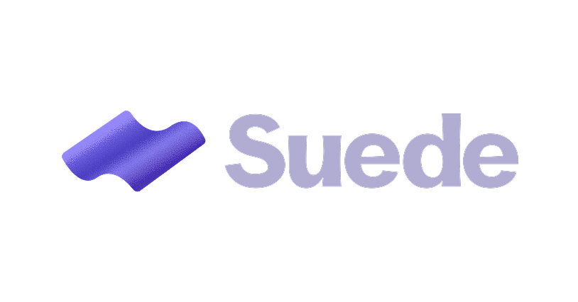

# Suede

A SvelteKit starter template with an agentic development process baked in.

Suede is two layers in one repo:

1. **A runtime stack** — SvelteKit on Cloudflare Pages + Workers, D1 + Drizzle for data, Vitest + Playwright for tests, Storybook for component states, stylebase + Bits UI for the design layer.
2. **A process layer** — a constant concept-to-merge pipeline, a decision graph (`deciduous`), in-repo skills and commands, and clear boundaries between what humans author and what agents author.

You don't build _in_ suede so much as you fork it: copy the repo, run the kickoff skill, and the new project inherits both layers with the details tailored to it.

[`AGENTS.md`](AGENTS.md) is the canonical rulebook — agent harnesses load it as the project instruction file, and it is the source of truth wherever this README summarizes. When the two disagree, AGENTS.md wins.

## Stack

| Concern         | Choice                                                                           |
| --------------- | -------------------------------------------------------------------------------- |
| Framework       | SvelteKit (Svelte 5)                                                             |
| Hosting         | Cloudflare Pages + Workers (`wrangler`)                                          |
| Database        | Cloudflare D1 via Drizzle ORM                                                    |
| Tests           | Vitest (+ Playwright browser tests)                                              |
| Component dev   | Storybook                                                                        |
| UI primitives   | Bits UI + [@taurean/stylebase](https://www.npmjs.com/package/@taurean/stylebase) |
| Package manager | pnpm                                                                             |

Every piece is a default, not a mandate — keep/rip decisions are made per fork during kickoff (see below).

## Getting started

```bash
pnpm install
cp .env.example .env   # fill in Cloudflare D1 credentials if using the DB
pnpm dev               # start the dev server
```

Day-to-day scripts:

| Command                                                     | What it does                                                                        |
| ----------------------------------------------------------- | ----------------------------------------------------------------------------------- |
| `pnpm dev`                                                  | Vite dev server                                                                     |
| `pnpm build`                                                | Production build (checks wrangler types first)                                      |
| `pnpm preview`                                              | Run the built Worker locally via wrangler                                           |
| `pnpm check`                                                | Type-check (svelte-check + wrangler types)                                          |
| `pnpm lint`                                                 | Prettier check + ESLint                                                             |
| `pnpm format`                                               | Prettier write                                                                      |
| `pnpm test`                                                 | Vitest, single run                                                                  |
| `pnpm storybook`                                            | Storybook dev server on port 6006                                                   |
| `pnpm db:push` / `db:generate` / `db:migrate` / `db:studio` | Drizzle workflows against D1 (each verifies `.env` first via `scripts/db-check.js`) |

The quality gate before any task is called done: `pnpm check`, `pnpm lint`, and `pnpm test` if tests changed — with command + result captured as evidence in the PR description.

## Starting a new project from suede

Suede is a template you duplicate, not a dependency you install. The flow:

1. **Copy the repo.** Clone suede (or copy the working tree) to a new directory. The working tree _is_ the new project — don't work on a side copy.
2. **Install and verify.** `pnpm install`, confirm `git status` is clean.
3. **Run the kickoff skill.** Tell the agent something like _"start a new project from this template"_ or _"fork suede"_. That triggers [`suede-kickoff`](.pi/skills/suede-kickoff/SKILL.md), which walks through:
   - **Capture lineage** — record the suede chronver tag and commit hash _before_ anything destructive. The tag lands in the new `package.json` as `"suede": { "from": "<tag>" }`.
   - **Reset history** — delete `.git`, init a fresh repo on `main`.
   - **Grilling session** — a one-question-at-a-time interview in two threads. **Thread A** captures the project itself (name, purpose, primary user, project shape, first version). **Thread B** captures process-layer tailoring: which stack pieces to keep or rip (Cloudflare, D1, Storybook, SvelteKit itself, …), version scheme (chronver vs semver), commit-type vocabulary, pipeline compression, and which skills apply.
   - **Bootstrap commit** — update `package.json` (name, version, `suede.from`), reset the `.deciduous/` graph, commit.
   - **Branch the follow-up task** — `chore/suede-kickoff`, where the Thread B answers are turned into actual edits to `AGENTS.md`, `.pi/`, configs, and this README. The kickoff skill deletes itself at the end of that task — it's consumed once.

The grill produces a plan; the follow-up branch produces the diff. No code is written during the interview.

Downstream forks can always trace their lineage: `package.json#suede.from` holds the suede tag they branched from.

## Working with the coding agent

Suede is built to be driven through a coding agent (Pi, Claude Code, or similar). The contract:

- **AGENTS.md is always loaded.** It defines the stack, the git workflow, the pipeline, and the guardrails. Agent-facing integration files live in `.pi/` (skills, prompts).
- **Authoring boundaries.** Humans own the presentation layer: Svelte component markup, `<style>` blocks, `src/lib/styles/`, design tokens. Agents own the TypeScript: `<script lang="ts">` blocks, `*.ts` in `src/lib/` and `src/routes/`, Drizzle schemas, server routes, Workers. An agent never edits markup or scoped CSS.
- **Storybook discipline.** A change to a UI primitive in `src/lib/components/` is incomplete without a story update in the same commit — stories are the agent-owned record of the human-owned visual contract.
- **The human merges.** Agents may branch, commit (with a co-author trailer crediting assistance), push branches, and apply tags — but never merge to `main` or push to it directly. Every task lands through a PR the human reviews.
- **Everything is recorded.** Decisions go in the decision graph in real time. Closed issues and merged PRs are the durable record of what shipped.

## From concept to merge

Every task moves through a happy-path pipeline. The _process_ is constant across all suede forks; the _details_ (branch convention, version scheme) are tailored at kickoff. Stages compress for small tasks — a prototype might skip the PRD file and tracker labels — but the shape stays.

The happy path is the six stages that fire for almost every unit of work:

1. **Concept** — a problem exists: in conversation, an issue, or a bug report.
2. **Align** (`task` step 0) — a short back-and-forth, one question at a time, until understanding is shared.
3. **Cut plan** (`project-plan`) — only for work too big for one PR: agree on the few independently-mergeable cuts, publish one plan issue with the cut checklist. Single-PR tasks skip straight to build.
4. **Build** (`task`) — prep (worktree, systems map, slice-brief, draft PR), then the bug / refactor / feature / meta path; vertical slices, one scenario test per user story (`task/testing.md`), Storybook discipline for UI primitives.
5. **Review** (`review`) — two-axis PR review (Standards + Spec) in parallel sub-agents, before merge.
6. **Release** (AGENTS.md "Releases") — chronver bump as the final commit on the branch; human merges and tags.

Stage skills all live in `.pi/skills/`. No global plugin is required.

### The shape of a single task

1. **Start** — create a worktree and branch `<type>/<slug>` from the latest `origin/main` (never from an in-flight branch), log a goal node with the verbatim prompt. If requirements are fuzzy, align on the goal before touching code.
2. **During** — log action nodes before major edits, honour authoring boundaries, commit as `<type>(<scope>): <subject>` in present-tense imperative, link each commit to the graph.
3. **End** — run the quality gate, bump the version (`chore(release): cut <version>` as the final commit), hand back. The human reviews the PR, merges, and the merge commit gets tagged on `main`.

Branch types and commit types share one vocabulary — the conventional-commits 1.0.0 list (`feat`, `fix`, `chore`, `docs`, `refactor`, `test`, `build`, `ci`, `perf`, `style`), enumerated in AGENTS.md.

## Tools

### Decision graph (`deciduous`)

Suede tracks project decisions as a graph: `goal → options → decision → actions → outcomes`, with observations attached anywhere. Logging is real-time, not retroactive — log what you're about to do, then log how it went, and link every commit to a node. The graph records the _project's_ decisions (what the user is building and choosing), never the agent's internal process.

- Rules and the node-flow model: AGENTS.md "Decision graph workflow"
- CLI mechanics, connection audit, and multi-user sync: [`.pi/skills/decision-graph/SKILL.md`](.pi/skills/decision-graph/SKILL.md)
- Web viewer: `deciduous serve`
- Nothing enforces the habit mechanically — real-time logging is carried by the AGENTS.md contract, and each release PR records whether the graph earned its keep that cycle.

### In-repo skills (`.pi/skills/`)

| Skill            | Purpose                                                                                               |
| ---------------- | ----------------------------------------------------------------------------------------------------- |
| `task`           | The task-process spine: goal alignment, prep, per-type execution paths, testing discipline, closeout  |
| `slice-brief`    | Per-PR brief that hands a vertical slice to a fresh agent session                                     |
| `systems-map`    | Create and maintain `SYSTEMS_MAP.md`                                                                  |
| `project-plan`   | Cut plan for multi-PR work; the fuller PRD / per-issue / triage ceremony preserved under `reference/` |
| `review`         | Two-axis PR review (Standards + Spec)                                                                 |
| `decision-graph` | Deciduous mechanics: node/edge commands, verbatim prompt capture, commit linking, audit, sync         |
| `suede-kickoff`  | One-shot bootstrap of a new project from a fresh suede clone (see above)                              |

### Prompts (`.pi/prompts/`)

User-invoked, loaded only when called:

| Prompt                   | Purpose                                                                   |
| ------------------------ | ------------------------------------------------------------------------- |
| `/pulse`                 | Map the system's _current_ state as decision nodes — no history, just now |
| `/narratives`            | Reconstruct how the system evolved, as prose narratives                   |
| `/archaeology`           | Turn those narratives into a backdated, queryable decision graph          |
| `/request-refactor-plan` | Short interview → deferred-refactor plan filed as a GitHub issue          |

## Git workflow and releases

- Branch from `main`, always. Every task is reviewed in a PR; the human is the only one who merges.
- The human is commit author; agent-made commits carry a co-author trailer.
- **chronver** by default (`YYYY.M.D[.N]`, no leading zeros): every release branch ships its own version bump as its final commit, the merge commit on `main` is tagged with the bare version string and pushed with `--follow-tags`, and `git log <prev>..<new>` is the changelog — no `CHANGELOG.md`. Libraries with dependents switch to semver at kickoff.
- Default tracker is GitHub Issues.

Full details: AGENTS.md "Git workflow", "Task flow", and "Releases".
